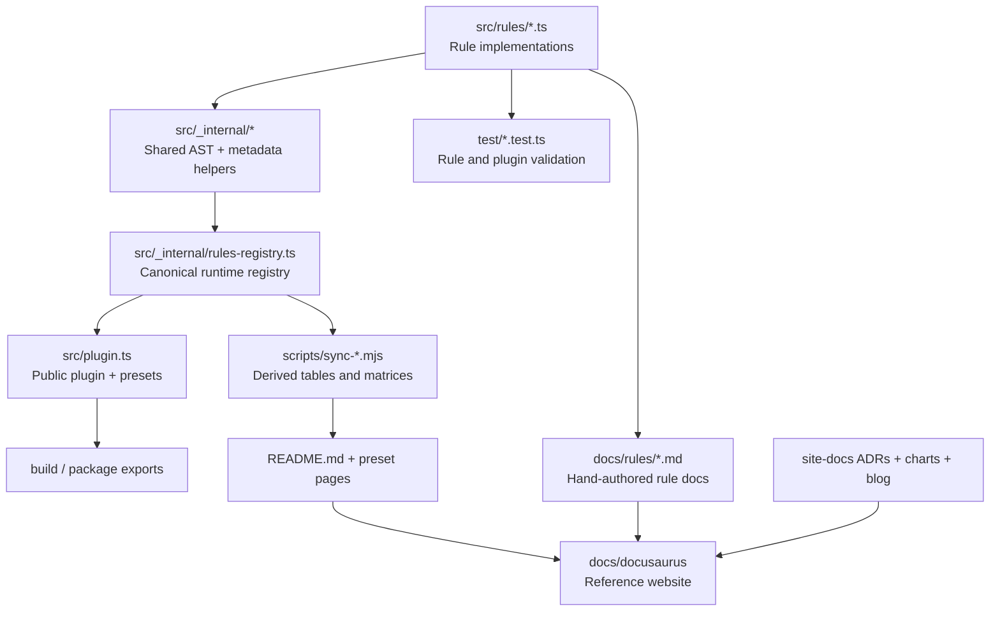

# Plugin architecture

This chart shows the main repository layers that shape the published plugin and the documentation site.

## Reading the diagram

- Rule code lives in `src/rules/`.
- Shared helpers and metadata utilities live under `src/_internal/`.
- The runtime registry and public plugin entrypoint are the canonical path into the published package.
- Documentation is intentionally split between hand-authored rule pages and synced summary tables.
