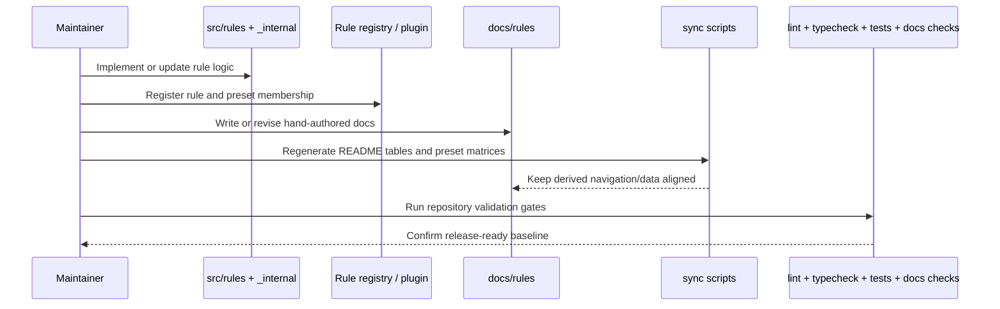

# Rule lifecycle and sync flow

This sequence highlights the expected maintainer flow when adding or changing a rule.

## Practical takeaway

A rule is not complete when the source file compiles. It is only complete when runtime wiring, docs, synced derived content, and validation all agree.
